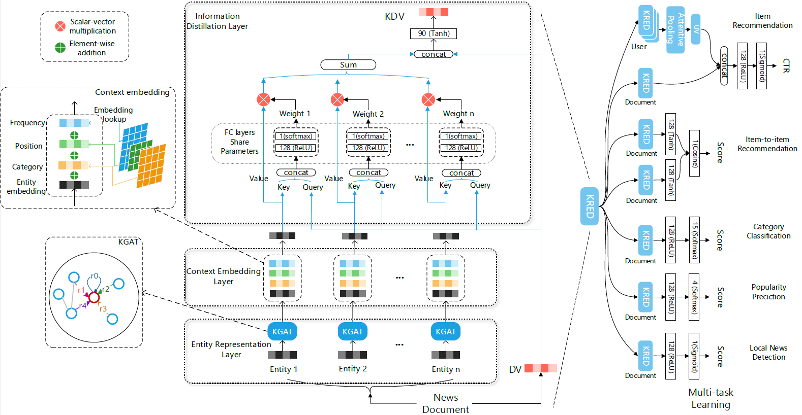

## Introduction

This repository is the implementation of [KRED: Knowledge-Aware Document Representation for News Recommendations](https://arxiv.org/abs/1910.11494)

A sample of how the code works can be found in the Jupyter Notebook 'KRED_full_pipeline.ipynb' 

## Model description



Knowledge Aware Representation Enhancement Model (KRED) is a knowledge enhanced framework which enhance a document embedding with knowledge information for multiple news recommendation tasks. The framework mainly contains two part: representation enhancement part(left) and multi-task training part(right).

##  Data description:

We use [MIND dataset](https://msnews.github.io) in this repo, due to MIND dataset doesn't contain location information, so in this experiments we do not use the local news detection task.

###  Running the code
```
$ python main.py  (this will run KRED for user2item single task training set by default parameters)
```

we also offer an example of our extensions in this notebook: KRED_full_pipeline.ipynb


## Environment
The code has been tested running under Python 3.6.10, with the following packages installed (along with their dependencies):
- numpy==1.19.1
- pytorchtools==0.0.2
- scikit-learn==0.23.2
- scipy==1.5.2
- torch==1.4.0

## Extensions
In this project, we have applied 2 extensions: Ablation study and New dataset application - Amazon Books Recommendation.
### Ablation study
We train and test the model by removing one of the layers and with multiple tasks: User to Item recommendation, Item to Item recommendation, and Article Category Classification.

### Amazon Books Recommendation
We build a new knowledge graph with the dataset: [Amazon Books](https://www.kaggle.com/datasets/mohamedbakhet/amazon-books-reviews?select=Books_rating.csv), and train it on our model.
